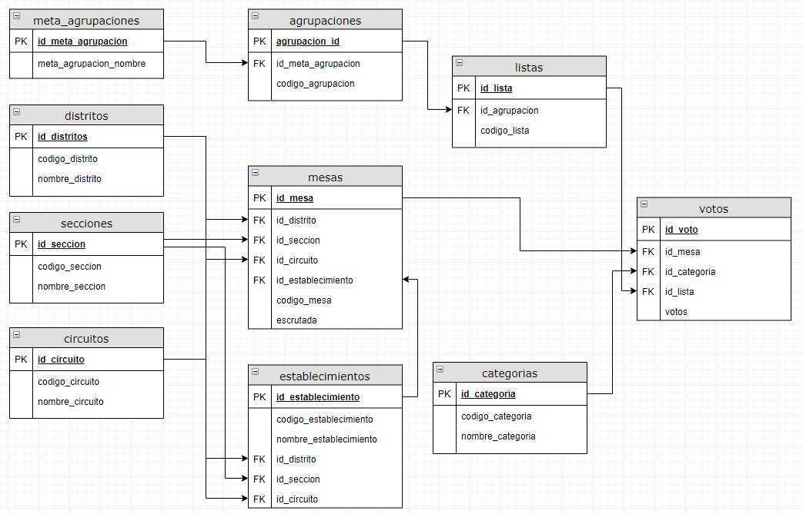

<!-- badges: start -->
  
  
  
  
  
  
  <!-- badges: end -->

# paso2019

Paquete de datos con los resultados del escrutinio de las "Paso 2019" de Argentina, tal cual publica la **Dirección Nacional Electoral (DINE)**.

## Contenido

### Datos

Los datos están actualizados al `12/08/2019 05:03:06 (-03:00 UTC)` según informa la **DINE**

**Importante**:

Hay algunas inconsistencias en los datos que en algún momento puede llamar la atención. Por empezar hay una inconsistencia entre las tres tablas de mesas descargadas del sitio oficial de los resultados:

* Dentro de las tablas originales, pudimos constatar, que `mesas_totales` tiene 100,142  mesas, 6 mesas menos que el resto de las tablas (`mesas_totales_lista` y `mesas_totales_agrp_politica`), esto no tiene mucho impacto, por que en el modelo de datos nuevo, usamos `mesas_totales_lista` para armar prácticamente todos los datos.

* La otra inconsistencia notable, es entre esta información y la que se publica en la página web: https://resultados.gob.ar/, la mesas escrutadas según esta página son 100,156 mesas, los datos descargados, indican en el mejor de los casos 100,148 mesas, es decir 8 mesas menos.

#### Modelo original

El modelo original representa las tablas originales distribuidas por la justicia electoral, tal cual se pueden acceder desde: http://descargaresultados.s3-sa-east-1.amazonaws.com/resultados.zip. Los archivos (de tipo DSV), fueron importados sin ninguna transformación, son `data.frames` básicos, la mayoría de las columnas son `character`, salvo las que representan cantidades de votos que son numéricas. Estas tablas no mutaran en el futuro. 

* descripcion_postulaciones (247 Kb)
* descripcion_regiones (497.7 kb)
* mesas_totales (56.6 mb)
* mesas_totales_lista (130 mb)
* mesas_totales_agrp_politica (104.9 mb)

Requerimiento de memoria total: **406.4Mb**

#### Modelo nuevo

Son tablas derivadas de las anteriores. La idea es transformar los datos en tablas que respeten mejor un modelo relacional. Estas tablas están en pleno procesos de creación y modificación. Usarlas con esta información en mente.

* agrupaciones (2.6 kb)
* categorias (37.7 kb)
* circuitos (473.3 Kb)
* distritos (2.6 kb)
* listas (202.6 kb)
* mesas (6.1 mb)
* meta_agrupaciones (7.2 kb)
* secciones (40.3 kb)
* votos (107.4 MB)

Requerimiento de memoria total: **114.2 Mb**

Este modelo elimina mucha de la redundancia de datos de los archivos originales, se generaron también `id's` numéricos para cada tabla, y así reducir los requerimientos de memoria. Claro, que las consultas requieren ir agregando varias relaciones. Por ejemplo, para consultar el total de votos de cada agrupación en la elección de presidente, habría que hacer algo así:

    library("tidyverse")
    library("paso2019")
    
    votos %>% 
      left_join(listas, by = "id_lista") %>% 
      left_join(agrupaciones, by = "id_agrupacion") %>% 
      left_join(categorias, by = "id_categoria") %>% 
      left_join(meta_agrupaciones, by = "id_meta_agrupacion") %>% 
      filter(nombre_categoria == "Presidente y Vicepresidente de la República") %>% 
      group_by(nombre_meta_agrupacion, votos_totales) %>% 
      summarise(votos = sum(votos)) %>% 
      mutate(porcentaje = votos / votos_totales) %>% 
      select(nombre_meta_agrupacion, votos, porcentaje ) %>% 
      arrange(-votos)
      
    # A tibble: 11 x 3
    # Groups:   nombre_meta_agrupacion [11]
       nombre_meta_agrupacion                            votos porcentaje
       <chr>                                             <dbl>      <dbl>
     1 FRENTE DE TODOS                                11622428    0.477  
     2 JUNTOS POR EL CAMBIO                            7825208    0.321  
     3 CONSENSO FEDERAL                                2007035    0.0823 
     4 VOTOS en BLANCO                                  758988    0.0311 
     5 FRENTE DE IZQUIERDA Y DE TRABAJADORES - UNIDAD   697776    0.0286 
     6 FRENTE NOS                                       642662    0.0264 
     7 UNITE POR LA LIBERTAD Y LA DIGNIDAD              533100    0.0219 
     8 MOVIMIENTO AL SOCIALISMO                         173585    0.00712
     9 FRENTE PATRIOTA                                   58575    0.00240
    10 MOVIMIENTO DE ACCION VECINAL                      36324    0.00149
    11 PARTIDO AUTONOMISTA                               32562    0.00134

### Funciones

* **get_telegrama_url()**: Para generar la url de la imagen digitalizada del telegrama
* **view_telegrama()**: Para ver la imagen del telegrama

## Instalación

Como cualquier otro paquete mantenido en github.com, el proceso es relativamente sencillo. En primer lugar necesitaremos `devtools`:

    install.packages("devtools")

una vez instalada este paquete, simplemente podremos instalar `paso2019` directamente desde el código fuente del repositorio:

    devtools::install_github("pmoracho/paso2019")

## Requerimientos

Ninguno en particular, salvo `devtools` para poder instalar este paquete, son datos, y eventualmente alguna que otra función que en principio intentaré que no requiera ningún paquete extra. 

## Actualizaciones

* 2019/09/28 - Incorporamos view_telegrama()
* 2019/08/22 - Incorporamos los votos en blanco
